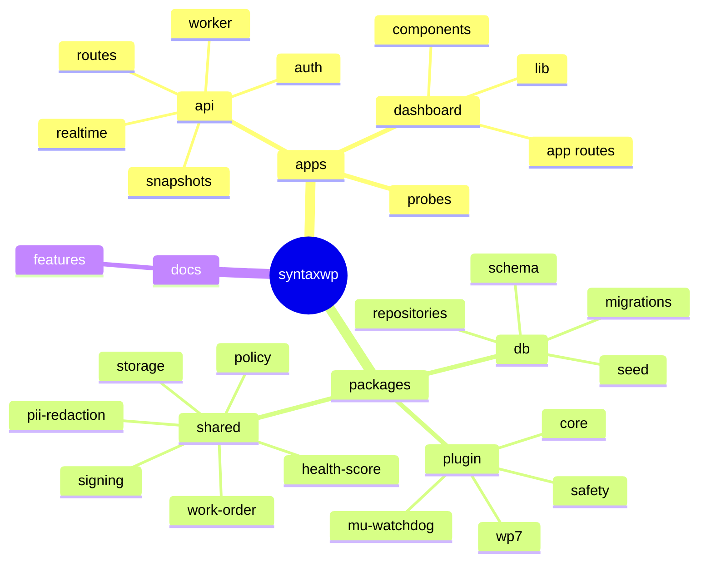

# SyntaxWP Project Search Graph

Use this as the fast map for finding code without re-scanning the repo.

## Root Map

```text
/Users/shafinoid/Documents/GitHub/syntaxwp
├── apps
│   ├── api                # Hono API, workers, routes, auth, snapshots, realtime
│   ├── dashboard          # Next.js dashboard UI, app routes, shared components
│   └── probes             # Cloudflare Workers probes / uptime checks
├── packages
│   ├── db                 # Drizzle schema, repos, migrations, seed, CLI utilities
│   ├── plugin             # WordPress plugin PHP code, safety, core, WP7 integration
│   └── shared             # Shared TS utilities, policy, signing, storage, scoring
├── docs                   # Feature docs
├── supabase               # Supabase config
├── README.md              # Top-level project overview
├── BACKEND-DEVELOPMENT-PLAN.md
├── LOCAL-DEVELOPMENT-SETUP.md
├── SECURITY-AUDIT.md
└── syntaxwp-mvp-architecture-v11.md
```

## Mermaid View



## Search Index

### API

Search terms:
- `route`, `router`, `hono`, `health`, `dashboard`, `sites`, `work-order`, `analytics`, `dev`, `ingestion`
- `worker`, `task`, `snapshot`, `integrity`, `diagnostics`, `dead-mans-switch`, `ssl`, `performance`, `vulnerability`
- `auth`, `site-auth`, `nonce`, `middleware`, `supabase`, `realtime`

Key files:
- [`apps/api/src/index.ts`](./apps/api/src/index.ts)
- [`apps/api/src/app.ts`](./apps/api/src/app.ts)
- [`apps/api/src/router/router.ts`](./apps/api/src/router/router.ts)
- [`apps/api/src/routes/health.ts`](./apps/api/src/routes/health.ts)
- [`apps/api/src/routes/sites.ts`](./apps/api/src/routes/sites.ts)
- [`apps/api/src/routes/work-orders.ts`](./apps/api/src/routes/work-orders.ts)
- [`apps/api/src/routes/analytics.ts`](./apps/api/src/routes/analytics.ts)
- [`apps/api/src/routes/dashboard.ts`](./apps/api/src/routes/dashboard.ts)
- [`apps/api/src/routes/dev.ts`](./apps/api/src/routes/dev.ts)
- [`apps/api/src/worker/index.ts`](./apps/api/src/worker/index.ts)
- [`apps/api/src/worker/tasks/index.ts`](./apps/api/src/worker/tasks/index.ts)
- [`apps/api/src/snapshots/capture.ts`](./apps/api/src/snapshots/capture.ts)
- [`apps/api/src/snapshots/revert.ts`](./apps/api/src/snapshots/revert.ts)
- [`apps/api/src/auth/middleware.ts`](./apps/api/src/auth/middleware.ts)
- [`apps/api/src/auth/site-auth.ts`](./apps/api/src/auth/site-auth.ts)
- [`apps/api/src/realtime/site-events.ts`](./apps/api/src/realtime/site-events.ts)

### Dashboard

Search terms:
- `page.tsx`, `layout.tsx`, `sidebar`, `status-rail`, `app-shell`
- `health-dial`, `glance-cards`, `charts`, `execution-stepper`
- `store`, `reports`, `updates`, `incidents`, `restore-points`, `performance`, `security`, `settings`, `design`

Key files:
- [`apps/dashboard/app/layout.tsx`](./apps/dashboard/app/layout.tsx)
- [`apps/dashboard/app/page.tsx`](./apps/dashboard/app/page.tsx)
- [`apps/dashboard/app/globals.css`](./apps/dashboard/app/globals.css)
- [`apps/dashboard/components/layout/app-shell.tsx`](./apps/dashboard/components/layout/app-shell.tsx)
- [`apps/dashboard/components/layout/sidebar.tsx`](./apps/dashboard/components/layout/sidebar.tsx)
- [`apps/dashboard/components/layout/status-rail.tsx`](./apps/dashboard/components/layout/status-rail.tsx)
- [`apps/dashboard/components/shared/welcome-banner.tsx`](./apps/dashboard/components/shared/welcome-banner.tsx)
- [`apps/dashboard/components/shared/health-dial.tsx`](./apps/dashboard/components/shared/health-dial.tsx)
- [`apps/dashboard/components/shared/glance-cards.tsx`](./apps/dashboard/components/shared/glance-cards.tsx)
- [`apps/dashboard/components/shared/charts.tsx`](./apps/dashboard/components/shared/charts.tsx)
- [`apps/dashboard/components/shared/execution-stepper.tsx`](./apps/dashboard/components/shared/execution-stepper.tsx)
- [`apps/dashboard/components/ui/page-header.tsx`](./apps/dashboard/components/ui/page-header.tsx)
- [`apps/dashboard/components/ui/data-table.tsx`](./apps/dashboard/components/ui/data-table.tsx)
- [`apps/dashboard/lib/api.ts`](./apps/dashboard/lib/api.ts)
- [`apps/dashboard/lib/stream-context.tsx`](./apps/dashboard/lib/stream-context.tsx)

### Database

Search terms:
- `schema`, `repository`, `migration`, `seed`, `client`, `migrate`
- `sites`, `orgs`, `work-orders`, `snapshots`, `incidents`, `audit-log`
- `plugin-inventory`, `performance-snapshots`, `site-auth-nonces`, `vulnerability-advisories`

Key files:
- [`packages/db/src/index.ts`](./packages/db/src/index.ts)
- [`packages/db/src/client.ts`](./packages/db/src/client.ts)
- [`packages/db/src/migrate.ts`](./packages/db/src/migrate.ts)
- [`packages/db/src/seed.ts`](./packages/db/src/seed.ts)
- [`packages/db/src/schema/index.ts`](./packages/db/src/schema/index.ts)
- [`packages/db/src/schema/sites.ts`](./packages/db/src/schema/sites.ts)
- [`packages/db/src/schema/work-orders.ts`](./packages/db/src/schema/work-orders.ts)
- [`packages/db/src/schema/incidents.ts`](./packages/db/src/schema/incidents.ts)
- [`packages/db/src/schema/audit-log.ts`](./packages/db/src/schema/audit-log.ts)
- [`packages/db/src/schema/plugin-inventory.ts`](./packages/db/src/schema/plugin-inventory.ts)
- [`packages/db/src/schema/snapshots.ts`](./packages/db/src/schema/snapshots.ts)
- [`packages/db/src/repositories/sites.ts`](./packages/db/src/repositories/sites.ts)
- [`packages/db/src/repositories/work-orders.ts`](./packages/db/src/repositories/work-orders.ts)
- [`packages/db/src/repositories/snapshots.ts`](./packages/db/src/repositories/snapshots.ts)
- [`packages/db/src/repositories/audit-log.ts`](./packages/db/src/repositories/audit-log.ts)
- [`packages/db/src/repositories/plugin-inventory.ts`](./packages/db/src/repositories/plugin-inventory.ts)

### Plugin

Search terms:
- `core`, `safety`, `wp7`, `mu-watchdog`, `heartbeat`, `work-order`, `capability`, `event-queue`
- `kill-switch`, `safe-mode`, `whitelist`, `validator`, `hmac`, `error-capture`
- `abilities`, `actions`, `mcp`, `executor`

Key files:
- [`packages/plugin/syntaxwp.php`](./packages/plugin/syntaxwp.php)
- [`packages/plugin/core/Heartbeat.php`](./packages/plugin/core/Heartbeat.php)
- [`packages/plugin/core/WorkOrderPoller.php`](./packages/plugin/core/WorkOrderPoller.php)
- [`packages/plugin/core/CapabilityRouter.php`](./packages/plugin/core/CapabilityRouter.php)
- [`packages/plugin/core/EventQueue.php`](./packages/plugin/core/EventQueue.php)
- [`packages/plugin/core/Hmac.php`](./packages/plugin/core/Hmac.php)
- [`packages/plugin/core/ErrorCapture.php`](./packages/plugin/core/ErrorCapture.php)
- [`packages/plugin/safety/KillSwitch.php`](./packages/plugin/safety/KillSwitch.php)
- [`packages/plugin/safety/SafeMode.php`](./packages/plugin/safety/SafeMode.php)
- [`packages/plugin/safety/ActionWhitelist.php`](./packages/plugin/safety/ActionWhitelist.php)
- [`packages/plugin/safety/WorkOrderValidator.php`](./packages/plugin/safety/WorkOrderValidator.php)
- [`packages/plugin/wp7/AbilitiesRegistrar.php`](./packages/plugin/wp7/AbilitiesRegistrar.php)
- [`packages/plugin/wp7/ActionExecutor.php`](./packages/plugin/wp7/ActionExecutor.php)
- [`packages/plugin/wp7/MCPEndpoints.php`](./packages/plugin/wp7/MCPEndpoints.php)
- [`packages/plugin/mu-watchdog/SyntaxWPWatchdog.php`](./packages/plugin/mu-watchdog/SyntaxWPWatchdog.php)

### Shared

Search terms:
- `policy`, `fix-intent`, `work-order`, `signing`, `storage`, `storage-s3`
- `health-score`, `revenue-loss`, `pii-redaction`, `hmac`, `site-secret`
- `actions`, `llm`

Key files:
- [`packages/shared/src/index.ts`](./packages/shared/src/index.ts)
- [`packages/shared/src/policy.ts`](./packages/shared/src/policy.ts)
- [`packages/shared/src/work-order.ts`](./packages/shared/src/work-order.ts)
- [`packages/shared/src/work-order-signing.ts`](./packages/shared/src/work-order-signing.ts)
- [`packages/shared/src/storage.ts`](./packages/shared/src/storage.ts)
- [`packages/shared/src/storage-s3.ts`](./packages/shared/src/storage-s3.ts)
- [`packages/shared/src/health-score.ts`](./packages/shared/src/health-score.ts)
- [`packages/shared/src/revenue-loss.ts`](./packages/shared/src/revenue-loss.ts)
- [`packages/shared/src/pii-redaction.ts`](./packages/shared/src/pii-redaction.ts)
- [`packages/shared/src/site-secret.ts`](./packages/shared/src/site-secret.ts)
- [`packages/shared/src/hmac.ts`](./packages/shared/src/hmac.ts)
- [`packages/shared/src/actions.ts`](./packages/shared/src/actions.ts)

### Docs

Search terms:
- `feature`, `architecture`, `plan`, `security`, `setup`

Key files:
- [`docs/features/auto-rollback-protection.md`](./docs/features/auto-rollback-protection.md)
- [`docs/features/wordpress-plugin-security.md`](./docs/features/wordpress-plugin-security.md)
- [`docs/features/audit-trail.md`](./docs/features/audit-trail.md)
- [`docs/features/multi-tenant-site-connection.md`](./docs/features/multi-tenant-site-connection.md)
- [`docs/features/policy-engine-approvals.md`](./docs/features/policy-engine-approvals.md)
- [`README.md`](./README.md)
- [`LOCAL-DEVELOPMENT-SETUP.md`](./LOCAL-DEVELOPMENT-SETUP.md)
- [`BACKEND-DEVELOPMENT-PLAN.md`](./BACKEND-DEVELOPMENT-PLAN.md)
- [`SECURITY-AUDIT.md`](./SECURITY-AUDIT.md)
- [`syntaxwp-mvp-architecture-v11.md`](./syntaxwp-mvp-architecture-v11.md)

## Fast Lookup

If you need:
- API routing or endpoints, start in `apps/api/src/router/router.ts` and `apps/api/src/routes/*`
- Worker jobs or scheduled maintenance, start in `apps/api/src/worker/tasks/*`
- Dashboard UI pages, start in `apps/dashboard/app/*`
- Shared business rules, start in `packages/shared/src/*`
- Database structure, start in `packages/db/src/schema/*`
- Persistence helpers, start in `packages/db/src/repositories/*`
- WordPress execution/safety logic, start in `packages/plugin/core/*` and `packages/plugin/safety/*`
- WP7 ability/MCP integration, start in `packages/plugin/wp7/*`
- Project requirements and rationale, start in `README.md` and `docs/features/*`

## Suggested Search Terms

When looking for code, try these first:
- `health`
- `snapshot`
- `work-order`
- `site-auth`
- `audit`
- `policy`
- `realtime`
- `performance`
- `vulnerability`
- `heartbeat`
- `rollback`

